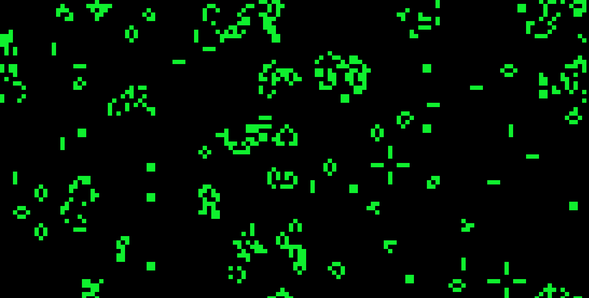
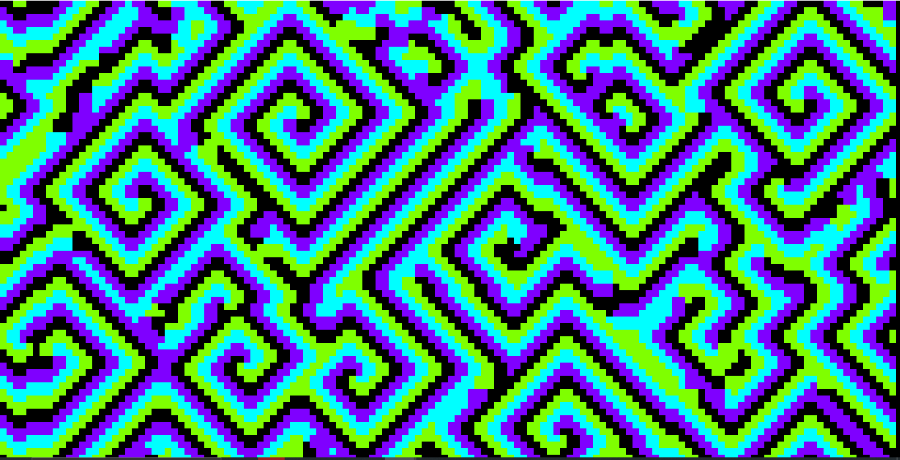
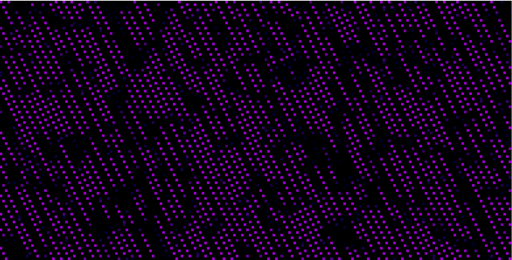
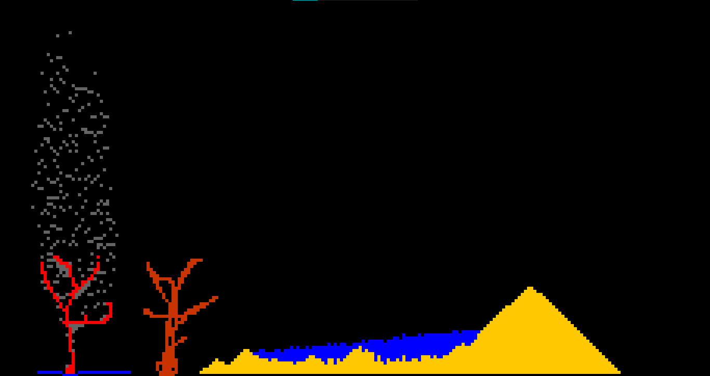
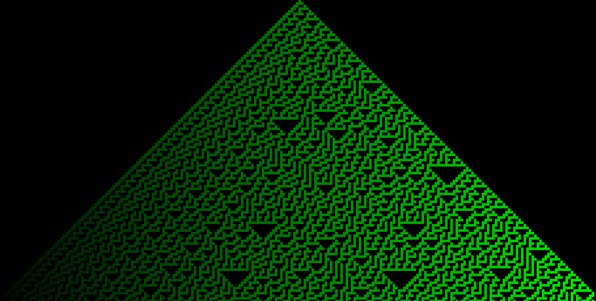

# Pi-s-Py-Art

Bonjour, voici notre projet pour les trophées NSI 2024 sur le thème **Art et Informatique**.

## Notre projet  

### Les Automates Cellulaires  

Les automates cellulaires sont une branche de l'informatique et des mathématiques étudiant le comportement de cellules dans une grille en suivant des règles simples.  

Ce sont des simulations, donc elles évoluent seules, mais il est possible d'intervenir en temps réel.  

Bien que les règles des automates cellulaires soient simples, de nombreux phénomènes peuvent émerger, allant de structures basiques à des comportements d'une grande complexité.  

---

## Comment lancer le projet  

Projet développé avec **Python 3.10.11**. 
Lancer le Bat Environement virtuelle 
Si il y a une erreur il est probable que le chemin du dossier soit trop long (Pour l'envirenement) donc il faut mettre le fichier le plus proche de la racine si l'envirenement virtuelle est utilisé

### Installation des dépendances  

```sh
pip install -r requirements.txt
```
---


##  Automates cellulaires présents dans le projet :
Nous explorerons plusieurs automates cellulaires populaires, tels que :
- ### Le jeu de la vie de John Conway

  
- ### Un Automate Cellulaire Cyclique


- ### Un Automate Celluaire Neuronal


- ### Une simulation "Falling Sand"


- ### Et bien plus encore...


---

### Prérequis

Python 3.8 ou plus

Bibliothèques requises : Pygame et autres dépendances listées dans requirements.txt


